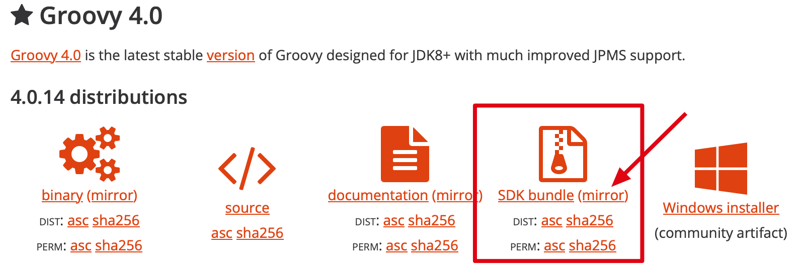

# 常用脚本

## clean-mvn-repository.groovy

用于清理本地 Maven 仓库中过时的 SNAPSHOT 文件 和 `.lastUpdated` 文件

1. 配置 Groovy 开发环境

- 下载 Groovy SDK：https://groovy.apache.org/download.html


- 配置环境变量 (macOS)

```bash
 export GROOVY_HOME=$HOME/groovy-4.0.14
 export PATH=$GROOVY_HOME/bin:$PATH
```

生效环境变量 `source .bash_profile`

- 测试配置

```bash
groovy -v
```

- 开始清理

```bash
groovy clean-mvn-repository.groovy
```

## gitpull.sh

批量更新当前目录下的所有 git 项目

在命令行运行脚本：
```bash
./gitpull.sh
```

## iTerm2Login.sh

用于 macOS 中 iTerm Terminal 工具自动登录脚本

使用方法：

1. 将 `iTerm2Login.sh` 脚本文件放到 `/usr/local/bin` 目录
2. 授权：`chmod a+x iTerm2Login.sh`
3. 打开 iTerm 并设置： Settings → Profiles → General
    - Command: Login Shell
    - Send text at start: iTerm2Login.sh `port` `user` `ip` `password`